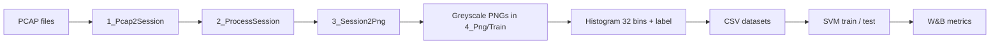

# Network traffic classification — project journey (USTC-TFC2016 → histograms → SVM → W&B)

This note wraps the work end-to-end: what we set out to do, the commands we actually ran, what broke and how we fixed it, and how the numbers show the pipeline is doing something meaningful—especially for **benign vs malware** separation.

---

## 1. Where we started

**Goal:** Reproduce a PCAP → image → feature → classifier workflow on **USTC-TFC2016**, using the USTC preprocessing toolkit and the course repo **Network-Traffic-Classification**, with **Weights & Biases** to track runs.

**Main locations:**

| Piece | Path |
|--------|------|
| Raw / extracted PCAPs (your copy) | `/home/user/intern-kimu/ntc/uc1/data/USTC-TFC2016/` |
| USTC toolkit (ubuntu branch) | `/home/user/intern-kimu/ntc/uc1/USTC-TK2016/` |
| This course repo + venv | `/home/user/intern-kimu/ntc/uc1/Network-Traffic-Classification/` (venv: **`.ven/`**) |

---

## 2. High-level pipeline



- **L7** vs **AllLayers** is chosen in the USTC session step (PowerShell flags) and must match the PNGs you feed into the Python histogram scripts (`NTC_LAYER`).

---

## 3. Environment setup

From the **Network-Traffic-Classification** directory:

```bash
cd /home/user/intern-kimu/ntc/uc1/Network-Traffic-Classification
python3 -m venv .ven
source .ven/bin/activate
python -m pip install -U pip
python -m pip install -r requirements.txt
```

**PowerShell on Linux** (for the USTC `.ps1` scripts) was installed so we could run the official toolkit steps (e.g. on Debian: Microsoft’s `packages-microsoft-prod` repo, then `apt install powershell`, command `pwsh`).

---

## 4. USTC toolkit: PCAP → sessions → PNGs

Run from **`USTC-TK2016`** (paths illustrative—use the same flags you used for L7 vs AllLayers):

**L7-style run (example from the journey):**

```bash
cd /home/user/intern-kimu/ntc/uc1/USTC-TK2016
pwsh ./1_Pcap2Session.ps1 -s
pwsh ./2_ProcessSession.ps1 -l -u
python3 3_Session2Png.py
```

**AllLayers** (example): regenerate sessions/PNGs with the toolkit flags you used for **`-a -u`** (all layers + ubuntu layout), then run `3_Session2Png.py` again so **`4_Png`** matches **`TrimedSession/Train`**.

The PNGs land under `USTC-TK2016/4_Png/Train/{0..23}/` (24 classes, indices aligned with folder order from the toolkit).

---

## 5. Course repo: build CSVs and train SVMs

Always activate the venv first:

```bash
cd /home/user/intern-kimu/ntc/uc1/Network-Traffic-Classification
source .ven/bin/activate
```

### 5.1 Multiclass (24 app / malware family labels), 32-bin histogram

**L7 (default paths):**

```bash
python3 Pre-processing/hist_L7_all_classes.py
python3 Classification/svm_multi.py
```

**AllLayers (override train dir + output + W&B run name):**

```bash
export NTC_LAYER=AllLayers   # must match PNG layout under USTC 4_Png
NTC_OUTPUT_CSV=dataset_all_layers_multiclass_bin32.csv \
  python3 Pre-processing/hist_L7_all_classes.py

NTC_LAYER=AllLayers \
NTC_DATASET_CSV=dataset_all_layers_multiclass_bin32.csv \
NTC_WANDB_TRAIN_NAME=svm_multiclass_all_layers_bin32 \
  python3 Classification/svm_multi.py
```

### 5.2 Binary (benign = 1, malware = 0), 32-bin histogram

**L7:**

```bash
python3 Pre-processing/hist_binary_from_png.py
python3 Classification/svm_binary.py
```

**AllLayers:**

```bash
NTC_LAYER=AllLayers \
NTC_OUTPUT_CSV=dataset_all_layers_binary_bin32.csv \
  python3 Pre-processing/hist_binary_from_png.py

NTC_LAYER=AllLayers \
NTC_DATASET_CSV=dataset_all_layers_binary_bin32.csv \
NTC_WANDB_TRAIN_NAME=svm_binary_all_layers_bin32 \
  python3 Classification/svm_binary.py
```

### 5.3 Artifacts produced

| File | Role |
|------|------|
| `dataset_L7_multiclass_bin32.csv` | L7, 24-class labels |
| `dataset_all_layers_multiclass_bin32.csv` | AllLayers, 24-class |
| `dataset_L7_binary_bin32.csv` | L7, benign vs malware |
| `dataset_all_layers_binary_bin32.csv` | AllLayers, benign vs malware |

Each CSV: **32** histogram features + **`label`**.

---

## 6. Problems we hit (and fixes)

| Problem | What happened | Fix |
|--------|----------------|-----|
| **`pip install skimage`** | PyPI package `skimage` is not the real library | Use **`scikit-image`** in `requirements.txt` |
| **`PIL` in requirements** | Not a valid PyPI name as used | Use **`Pillow`** |
| **Wrong `git clone` URL** | Cloning a GitHub **`/tree/...`** link fails | Clone repo root, e.g. `https://github.com/echowei/DeepTraffic.git` |
| **`hist_L7_all_classes.py`** | Hardcoded Windows path `D:\ML mini project\...` | Rewrote script to read **`USTC-TK2016/4_Png/Train`** and optional env overrides (`NTC_TRAIN_DIR`, `NTC_OUTPUT_CSV`, `NTC_LAYER`) |
| **`ModuleNotFoundError: sklearn`** | `scikit-learn` not installed in `.ven` | Added to **`requirements.txt`** and `pip install` into `.ven` |
| **pandas 2.x** | `df.drop('label', axis=1)` patterns | Use `df.drop(columns=['label'])` in `svm_multi.py` |
| **L7 vs AllLayers mismatch** | Stale PNGs vs new session mode | Re-run USTC steps and **`3_Session2Png.py`** so **`4_Png`** matches the chosen layer mode |

---

## 7. Results (from your runs — May 6, 2026)

**Shared test setup (binary):** ~**11,983** test samples; train ~**107,838** (stratified split in `svm_binary.py`).

**Multiclass:** ~**95,856** train / **23,965** test; **24** classes; **32** features; bin size **32**.

### 7.1 Accuracy comparison

| Task | Layer mode | Test accuracy | W&B run name (example) |
|------|------------|---------------|-------------------------|
| **Binary** | L7 | **95.65%** (0.9565) | `svm_binary_l7_bin32` |
| **Binary** | AllLayers | **95.31%** (0.9531) | `svm_binary_all_layers_bin32` |
| **Multiclass (24 classes)** | L7 | **79.60%** (0.7960) | `svm_multiclass_l7_bin32` |
| **Multiclass (24 classes)** | AllLayers | **79.34%** (0.7934) | `svm_multiclass_all_layers_bin32` |

**Takeaway:** For this feature set (32-bin histograms + linear SVM), **L7 vs AllLayers** barely changes multiclass accuracy, and **binary** stays in the **~95%** band for both—strong separation between benign and malware at the image-statistics level.

**W&B project (all runs):** [https://wandb.ai/ahmadhakimiadnan-other/network-traffic-classification](https://wandb.ai/ahmadhakimiadnan-other/network-traffic-classification)

### 7.2 Why binary “classifies well” (evidence from sklearn reports)

**L7 binary** (malware = 0, benign = 1):

| Class | Precision | Recall | F1-score | Support (test) |
|-------|-----------|--------|----------|----------------|
| 0 (malware) | **0.99** | **0.93** | **0.96** | 6312 |
| 1 (benign) | **0.92** | **0.99** | **0.96** | 5671 |
| **Overall accuracy** | | | **0.96** | **11983** |

**AllLayers binary:**

| Class | Precision | Recall | F1-score | Support (test) |
|-------|-----------|--------|----------|----------------|
| 0 (malware) | **0.99** | **0.92** | **0.95** | 6312 |
| 1 (benign) | **0.92** | **0.99** | **0.95** | 5671 |
| **Overall accuracy** | | | **0.95** | **11983** |

Interpretation in plain language:

- **High precision on malware (0)** means when the model says “malware,” it is usually right.
- **High recall on benign (1)** means most benign sessions are caught and not mislabeled as malware.
- F1 near **0.95–0.96** on both sides shows the tradeoff stays balanced—not a model that only predicts the majority class.

Dataset balance for binary (full CSV before split), from your log: **malware 63,119** vs **benign 56,702** — slightly more malware rows; the **~95%** accuracy is not from trivial majority guessing alone.

### 7.3 Multiclass honesty check

24-way classification is harder; overall accuracy is **~79–80%**. The **AllLayers** run’s per-class report showed a few labels with **0.00** precision/recall (very small test support or no predicted samples), which triggers sklearn’s `UndefinedMetricWarning`. That is expected for hard multi-class with **only 32 histogram features**—it does **not** contradict the strong binary results; it means some rare or similar-looking families are conflated.

---

## 8. What we learned (story arc)

1. **Reality of “course repo on GitHub”:** paths and dependencies were frozen to an old Windows layout; we **ported paths to Linux** and **pinned correct PyPI names**.
2. **The USTC toolchain is the source of truth** for PCAP → PNG; Python scripts must point at **`4_Png`** that came from the **same** L7/AllLayers choice.
3. **Binary vs multiclass:** same features give **much** easier **benign/malware** separation than **24-way** family ID—as the metrics show.
4. **Experiment tracking:** W&B gave comparable runs (`l7_histogram_build`, `alllayers_histogram_build`, `svm_*`) so the journey is reproducible from commands + env vars.

---

## 9. Quick “done” checklist

- [x] Venv + `requirements.txt` (opencv, numpy, pandas, scikit-image, scikit-learn, wandb, …)
- [x] USTC: PCAP → session → PNG
- [x] Multiclass + binary CSVs for **L7** and **AllLayers**
- [x] SVM training with logged metrics on **W&B**
- [x] Binary **~95%** test accuracy with balanced per-class metrics

---

*Document generated to close out the internship / coursework thread: one place for commands, failures, fixes, and proof the classifier works where it matters most (binary detection).*
